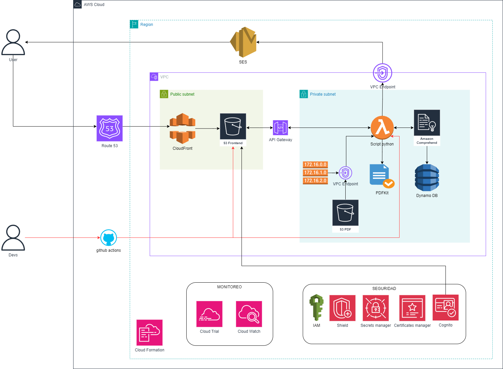

# Análisis de Requerimientos para la Arquitectura en AWS

## 1. Introducción

El objetivo de este análisis es diseñar una arquitectura en la nube utilizando AWS, que permita la implementación de un sistema para el análisis de impactos de la ansiedad.

### Descripción del sistema

El sistema está diseñado para ayudar a los usuarios a gestionar su ansiedad mediante el análisis de encuestas y la generación de informes personalizados.

El usuario accede al sistema a través de un portal web, donde inicia sesión con sus credenciales. Luego, completa una encuesta que evalúa su nivel de ansiedad. Los datos de la encuesta son enviados a AWS Lambda, que procesa la información utilizando Amazon Comprehend para analizar patrones y detectar tendencias emocionales.

Los resultados del análisis se almacenan en Amazon DynamoDB, permitiendo un acceso rápido y seguro. Con base en estos datos, el sistema genera un informe en PDF, el cual se guarda en Amazon S3. Posteriormente, el usuario recibe una notificación por correo electrónico con el resultado de su análisis y un enlace para descargar el informe.

Además, el sistema permite a los usuarios consultar su historial de encuestas, facilitando un seguimiento continuo de su evolución emocional. Esta funcionalidad les ayuda a visualizar su progreso y tomar decisiones informadas sobre su bienestar.

## 2. Requerimientos funcionales (RF)

### 2.1. Acceso y autenticación

- **RF-01:** El sistema debe permitir que los usuarios se registren con correo electrónico y contraseña o mediante proveedores externos (Amazon Cognito).
- **RF-02:** Se debe implementar autenticación multifactor (MFA) para usuarios administrativos y críticos.
- **RF-03:** El sistema debe permitir la gestión de roles y permisos.

### 2.2. Procesamiento de datos

- **RF-04:** El sistema debe permitir a los usuarios ingresar datos manualmente o mediante archivos CSV.
- **RF-05:** El procesamiento de datos debe realizarse en tiempo real mediante servicios serverless o contenedores en AWS.
- **RF-06:** Los resultados del análisis deben presentarse en formatos visuales e informes descargables (PDF).

### 2.3. Gestión del sistema

- **RF-07:** Los administradores deben poder modificar, eliminar y agregar datos de referencia al sistema.
- **RF-08:** El sistema debe permitir soporte técnico remoto para resolución de incidentes.
- **RF-09:** Se debe almacenar un historial de accesos y cambios en los datos para auditoría.

### 2.4. Disponibilidad y rendimiento

- **RF-10:** El sistema debe estar disponible 24/7 con un nivel de disponibilidad del 99.9%.
- **RF-11:** El tiempo de respuesta de cualquier solicitud no debe superar 3 segundo en condiciones normales de uso.
- **RF-12:** El sistema debe permitir el acceso simultáneo de hasta 10,000 usuarios sin degradación del servicio.

## 3. Requerimientos no funcionales-

El sistema debe garantizar alta disponibilidad y resiliencia frente a fallos, asegurando que no haya pérdida de datos ni interrupciones de servicio.

### 3.1. Escalabilidad

- **RNF-01:** La infraestructura debe escalar horizontalmente, aumentando o reduciendo instancias según la carga.
- **RNF-02:** Se debe usar Auto Scaling en los microservicios para gestionar variaciones en la demanda.

### 3.2. Seguridad

- **RNF-03:** Toda la comunicación debe estar cifrada.
- **RNF-04:** Se debe implementar detección de intrusos y ataques DDoS con AWS Shield.
- **RNF-05:** Se debe implementar control de acceso granular mediante AWS IAM y políticas estrictas de permisos.

### 3.3. Mantenimiento y Monitoreo

- **RNF-06:** Se debe configurar CloudWatch y CloudTrail para monitorear actividad y detectar fallos.
- **RNF-07:** Se deben realizar pruebas de seguridad periódicas.
- **RNF-08:** El sistema debe permitir actualizaciones sin afectar la disponibilidad mediante implementaciones.

## 4. Arquitectura del Sistema

El sistema se diseñará con una arquitectura basada en microservicios desplegados en AWS, con integración entre los siguientes componentes:

- **Cloud Formation:** Generar la infraestructura.
- **Amazon API Gateway:** Punto de entrada centralizado para las solicitudes de los usuarios.
- **AWS Lambda:** Procesamiento serverless de los datos.
- **Amazon DynamoDB:** Base de datos NoSQL escalable para almacenar datos de análisis.
- **Amazon S3:** Almacenamiento de archivos, incluyendo PDFs generados.
- **Amazon SES:** Servicio para envío de correos electrónicos con resultados.
- **Amazon Cognito:** Gestión de autenticación y autorización.
- **Shield:** Seguridad avanzada contra ataques.
- **Secrets manager:** Credenciales y tokens.
- **Credentials manager:** Conexiones SSL/TLS.
- **Cognito:** Autenticación.
- **AWS CloudWatch y CloudTrial:** Monitoreo y logs de actividad.
- **AWS Auto Scaling:** Ajuste dinámico de capacidad para optimizar costos y rendimiento.

El sistema se desplegará en una **VPC con subredes públicas y privadas**, asegurando la seguridad y aislamiento de recursos críticos.

## 5. Implementación de CI/CD en AWS (Github-actions)

### **CI/CD para el Frontend (S3 + CloudFront)**

Cada vez que haya un cambio en el código del frontend, el despliegue debe ser automático:

1. **Construcción del proyecto (`npm build`)**.
2. **Subida del código a S3**.
3. **Invalidación de caché en CloudFront**.

### **CI/CD para el Backend (Lambda + API Gateway) con Github-actions**

Cada vez que haya un cambio en el backend:

1. **Empaquetar la función Lambda**.
2. **Actualizar la Lambda en AWS**.
3. **Desplegar API Gateway (si es necesario)**.

## 6. Arquitectura en la nube

# 7. Arquitectura Detallada en AWS

## **📌 Flujo del Sistema**

### **1️⃣ Acceso del Usuario**

1. **El usuario ingresa a la plataforma a través de Route 53**.
   - *Amazon Route 53* es el servicio de DNS que permite a los usuarios acceder a la plataforma mediante un nombre de dominio.
   - Redirige el tráfico al **frontend alojado en S3 y distribuido con CloudFront**.

---

### **2️⃣ Carga del Frontend**

2. **El frontend está alojado en S3 y distribuido con CloudFront**.
   - *Amazon S3* almacena los archivos estáticos del frontend.
   - *Amazon CloudFront* actúa como CDN, optimizando la entrega de contenido y reduciendo la latencia global.

3. **El frontend se comunica con el backend a través de API Gateway**.
   - *Amazon API Gateway* gestiona las solicitudes HTTP del usuario.
   - Redirige las peticiones a una **Lambda en la subred privada** dentro de la VPC.

---

### **3️⃣ Procesamiento en el Backend**

4. **La Lambda en la subred privada procesa los datos con Amazon Comprehend**.
   - *AWS Lambda* ejecuta código en Python sin necesidad de servidores.
   - *Amazon Comprehend* realiza análisis de lenguaje natural sobre los datos enviados por el usuario.

5. **Los resultados del análisis se almacenan en Amazon DynamoDB**.
   - *DynamoDB* es una base de datos NoSQL altamente escalable.
   - Permite consultas rápidas sin afectar el rendimiento del sistema.

---

### **4️⃣ Generación y Almacenamiento de PDF**

6. **La Lambda genera un PDF con los resultados y lo guarda en S3**.
   - *Amazon S3 (Bucket de PDFs)* almacena los informes generados.
   - **VPC Endpoint (Gateway) para S3** permite la conexión privada entre Lambda y S3.
   - La **tabla de enrutamiento** de la subred privada direcciona las solicitudes a S3.

---

### **5️⃣ Notificación al Usuario**

7. **La Lambda envía una notificación al usuario por correo con SES**.
   - *Amazon Simple Email Service (SES)* envía correos con los resultados.
   - **VPC Endpoint (Interface) para SES** permite que Lambda acceda a SES sin salir a Internet.

---

## **🔍 Monitoreo y Seguridad**

### **🔹 Monitoreo**

- *Amazon CloudWatch*: Captura logs y métricas en tiempo real.
- *AWS CloudTrail*: Registra acciones realizadas en la infraestructura para auditoría.

### **🔹 Seguridad**

- *AWS IAM*: Control de acceso a recursos.
- *AWS Shield*: Protección contra ataques DDoS.
- *AWS Secrets Manager*: Gestión de credenciales y claves API.
- *AWS Certificate Manager*: Manejo de certificados SSL.
- *Amazon Cognito*: Gestión de autenticación y autorización de usuarios.

# 8. 📌 Análisis de Costos en AWS

## **1️⃣ Route 53 (DNS y dominio)**

- **Registro de dominio:** ~$12 - $15 USD/año.
- **Resolución de consultas DNS:** ~$0.40 USD por millón de consultas.

## **2️⃣ S3 (Frontend + Almacenamiento de PDFs)**  

### **Frontend:**  

- **Almacenamiento:** ~$0.023 USD/GB.
- **Solicitudes GET/PUT:** ~$0.0004 USD por 1,000 solicitudes.

### **Bucket de PDFs:**  

- **Almacenamiento:** ~$0.023 USD/GB (capa estándar).  
- **Solicitudes GET/PUT:** ~$0.0004 USD por 1,000 solicitudes.  
- **Glacier (almacenamiento a largo plazo):** ~$0.004 USD/GB.  

**Total estimado:** ~$5 - $20 USD/mes (según tráfico y almacenamiento).  

---

## **3️⃣ CloudFront (Distribución del frontend con CDN)**  

- **Costo por tráfico:** ~$0.085 USD/GB en Norteamérica y Europa.  
- **Solicitudes HTTP/HTTPS:** ~$0.0002 USD por solicitud.  
- **Invalidación de caché:** Primeras 1,000 gratis, después ~$0.005 USD por solicitud.  

**Total estimado:** ~$5 - $50 USD/mes (según tráfico).  

---

## **4️⃣ API Gateway (Conexión entre frontend y backend)**  

- **Costo por solicitud:** ~$3.50 USD por millón de solicitudes (REST API).  
- **Costo de transferencia de datos:** ~$0.09 USD/GB.  

**Total estimado:** ~$5 - $30 USD/mes (según uso).  

---

## **5️⃣ AWS Lambda (Ejecución del backend)**  

- **Memoria utilizada:** ~$0.00001667 USD por GB-segundo.  
- **Solicitudes:** Primer millón gratis, después ~$0.20 USD por millón.  

**Ejemplo:**  

- 512MB de RAM, 500ms de ejecución, 1M de solicitudes: **~$2 USD/mes**.  
- 10M de solicitudes/mes: **~$20 USD/mes**.  

**Total estimado:** ~$2 - $30 USD/mes.  

---

## **6️⃣ DynamoDB (Base de datos NoSQL)**  

- **25 GB gratis**.  
- **Escrituras:** ~$1.25 USD por millón de operaciones.  
- **Lecturas:** ~$0.25 USD por millón de operaciones.  
- **Almacenamiento adicional:** ~$0.25 USD por GB.  

**Total estimado:** ~$5 - $30 USD/mes.  

---

## **7️⃣ Amazon Comprehend (Análisis de texto con IA)**  

- **Costo por unidad de texto analizado:** ~$0.0001 USD por 100 caracteres.  

**Ejemplo:**  

- 1,000 palabras por consulta (~5,000 caracteres).  
- 10,000 usuarios al mes: **~$50 USD/mes**.  

**Total estimado:** ~$10 - $100 USD/mes (según uso).  

---

## **8️⃣ Amazon SES (Envío de emails)**  

- **62,000 correos gratis/mes** si se usa EC2.  
- **Costo estándar:** ~$0.10 USD por 1,000 emails enviados.  
- **Costo de adjuntos:** ~$0.12 USD por GB.  

**Total estimado:** ~$5 - $20 USD/mes.  

---

## **9️⃣ VPC Endpoints (Conexión privada a S3 y SES)**  

- **Costo por interfaz endpoint:** ~$7 USD/mes por endpoint.  
- **Si usas 2 endpoints (S3 y SES):** ~$14 USD/mes.  

---

## **🔍 Costos Adicionales**  

- **CloudWatch (Monitoreo y logs):** ~$3 - $10 USD/mes.  
- **IAM, Secrets Manager, Certificate Manager:**  
  - **IAM:** Gratis.  
  - **Secrets Manager:** ~$0.40 USD por secreto almacenado.  
  - **Certificate Manager:** Gratis si usas certificados de AWS.  

---

## **📌 Cálculo Total Estimado**  

| Servicio | Costo Estimado (USD/mes) |  
|----------|------------------------|  
| **Route 53** | $1 - $5 |  
| **S3 (Frontend + PDFs)** | $5 - $20 |  
| **CloudFront** | $5 - $50 |
| **API Gateway** | $5 - $30 |
| **Lambda** | $2 - $30 |  
| **DynamoDB** | $5 - $30 |  
| **Comprehend** | $10 - $100 |  
| **SES** | $5 - $20 |  
| **VPC Endpoints** | $14 |  
| **CloudWatch + Seguridad** | $3 - $10 |  
| **TOTAL** | **$55 - $300**/mes |  

---

## **🎯 Resumen**  

- **Costo mínimo (~$55/mes):** Uso bajo (~1M de solicitudes, poco almacenamiento).  
- **Costo moderado (~$150/mes):** Tráfico mediano (~5-10M de solicitudes/mes, más almacenamiento y análisis).  
- **Costo alto (~$300/mes):** Alta demanda y más procesamiento en Comprehend.

## 9. Conclusión

El diseño basado en microservicios y la implementación en AWS permitirán una solución escalable y segura. La automatización mediante infraestructura como código optimiza la gestión y reducción de costos operativos.

## 10. Trabajo futuro

- Implementación de Machine Learning con Amazon SageMaker para mejorar el análisis de datos.

## 11. 🛠️ Solución de Dudas

### **1️⃣ ¿Por qué DynamoDB como base de datos?**

- DynamoDB es altamente escalable y se adapta a cargas variables de tráfico.
- Es una base de datos **NoSQL** con baja latencia y alta disponibilidad.
- No requiere administración de servidores y permite consultas rápidas.

### **2️⃣ ¿Por qué usar VPC Endpoint y no NAT Gateway?**

- **VPC Endpoint** permite que los servicios en la VPC se comuniquen con S3 y SES sin salir a Internet.
- **NAT Gateway** implica un costo adicional y expone tráfico a Internet.
- VPC Endpoints son más seguros y reducen costos operativos.

### **3️⃣ ¿Cómo funciona la seguridad y por qué se incluyó cada módulo?**

- **IAM:** Controla los accesos y permisos en AWS.
- **Shield:** Protección contra ataques DDoS.
- **Secrets Manager:** Almacenamiento seguro de claves y credenciales.
- **Certificate Manager:** Manejo automático de certificados SSL.
- **Cognito:** Autenticación y gestión de usuarios sin comprometer seguridad.

### **4️⃣ ¿Qué es Amazon Comprehend y para qué se usa?**

- Es un servicio de procesamiento de lenguaje natural (NLP) de AWS.
- Permite analizar sentimientos, clasificar texto y extraer información clave.
- Se usa para procesar los datos ingresados por el usuario y generar análisis automatizados.

### **5️⃣ ¿Por qué una subred es privada y la otra es pública?**

- **Subred pública:** Aloja el frontend y API Gateway para recibir tráfico de Internet.
- **Subred privada:** Protege servicios críticos como Lambda, DynamoDB y almacenamiento de PDFs.
- Mejora la seguridad evitando exposición innecesaria a Internet.

### **6️⃣ ¿Por qué se usa API Gateway para conectar las subredes?**

- Actúa como intermediario seguro entre el frontend y el backend.
- Maneja autenticación y control de acceso con Cognito.
- Reduce la carga en los servicios backend al gestionar caché y limitación de tráfico.

### **7️⃣ ¿Por qué GitHub Actions y no CodeBuild de AWS?**

- **GitHub Actions** es más flexible y se integra nativamente con repositorios GitHub.
- **CodeBuild** es más costoso y depende de AWS, mientras que GitHub Actions es gratuito para repositorios públicos.
- Permite definir flujos CI/CD personalizados sin depender completamente de AWS.
